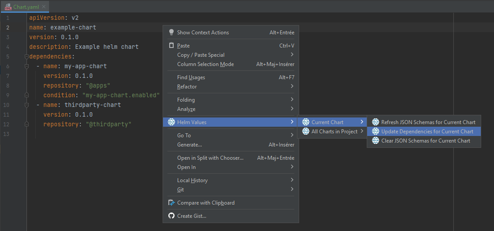
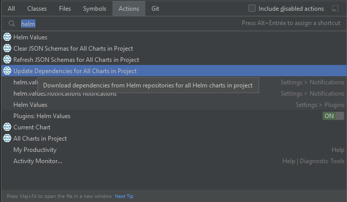

# IntelliJ plugin for Helm values


[](https://plugins.jetbrains.com/plugin/19970-helm-values-assistant)
[](https://plugins.jetbrains.com/plugin/19970-helm-values-assistant)

<!-- Plugin description -->
**Ease configuration of values for [Helm charts](https://helm.sh/) in your IDE**

The plugin provides several actions to generate [JSON schemas](https://json-schema.org/) for values of Helm charts.\
These schemas can then be used in your IDE to document, validate and auto-complete Helm values.

Plugin also allows to update Helm dependencies for Helm charts directly from your IDE.\
_This requires [installation of Helm](https://helm.sh/docs/intro/install/) on your local workstation
and [configuration of Helm repositories](https://helm.sh/docs/helm/helm_repo/)._

More information: [Helm values documentation](https://github.com/fstaudt/helm-values#readme)
<!-- Plugin description end -->

## Actions

### Refresh JON schemas for current chart

Action *Refresh JSON schema for current chart* is available from `Chart.yaml` or `values.yaml`.


Action will trigger the following processing:

- clear previously extracted JSON schemas
- download JSON schemas from external JSON schema repositories (unless already downloaded)\
  *Action only attempts to download JSON schemas for each dependency*
  *if a repository mapping is defined for the Helm repository of the dependency.*\
  *Check dedicated section to [configure JSON schema repositories](#configure-json-schema-repositories).*\
  *A fallback schema is generated if package of chart dependency is missing or invalid.*\
  *The description of the fallback schema provides more information on the extract issue.*
- extract file `values.schema.json` from chart dependencies (if available)\
  *A fallback schema is generated if JSON schema can't be extracted from dependency archive*
  *(archive not found, corrupted archive ...).*\
  *The description of the fallback schema provides more information on the download issue.*
- generate aggregated JSON schema `aggregated-values.schema.json` in `.idea/json-schemas/<chart name>/`\
  *Action only aggregates extracted JSON schemas for each dependency*
  *if a repository mapping is **not** defined for the Helm repository of the dependency.*\
  *Check dedicated section to [configure JSON schema repositories](#configure-json-schema-repositories).*

The JSON schema `aggregated-values.schema.json` is used by default to validate file `values.yaml`
in the same folder as `Chart.yaml`.\
Additional JSON schema mappings can be configured 
in [IntelliJ settings](https://www.jetbrains.com/help/idea/json.html#ws_json_schema_add_custom)
if required (e.g. for other values files applied after packaging).

Optional file `aggregated-values.schema.patch.json` can be created in the base folder of the chart
(same folder as Chart.yaml) to [patch aggregated JSON schema](https://jsonpatch.com/).\
For more information on patch files, check dedicated section
on [patch for generated JSON schemas](../README.md#patch-for-generated-json-schemas).

### Clear JSON schemas for current chart

Action *Clear JSON schema for current chart* is available from `Chart.yaml` or `values.yaml`.


Action will trigger the following processing:

- clear previously downloaded JSON schemas for the current chart
- clear previously extracted JSON schemas for the current chart
- clear generated JSON schema for the current chart (`aggregated-values.schema.json`)

### Update dependencies for current chart

Action *Update dependencies for current chart* is available from `Chart.yaml` or `values.yaml`.



Action will trigger the following processing:
- update Helm repositories (`helm repo update`)
- update dependencies for the current chart (`helm dependency update --skip-refresh`)

_Action requires [installation of Helm](https://helm.sh/docs/intro/install/) on local workstation 
and [configuration of Helm repositories](https://helm.sh/docs/helm/helm_repo/)._

### Refresh JSON schemas for all charts in project

Action *Refresh JSON schemas for all charts in project* is available from actions search and from "All charts in project" menu.


It will trigger the refresh of JSON schemas for each chart in the project
(i.e. for each file named `Chart.yaml` in the project).

### Clear JSON schemas for all charts in project

Action *Clear JSON schema for all charts in project* is available from actions search and from "All charts in project" menu.


It will clear JSON schemas for each chart in the project (i.e. for each file named `Chart.yaml` in the project).

### Update dependencies for all charts in project

Action *Update dependencies for all charts in project* is available from actions search and from "All charts in project" menu.



It will trigger the update of Helm dependencies for each chart in the project (i.e. for each file named `Chart.yaml` in the project).\
Update of Helm repositories is however only executed once for all charts in project.

_Action requires [installation of Helm](https://helm.sh/docs/intro/install/) on local workstation
and [configuration of Helm repositories](https://helm.sh/docs/helm/helm_repo/)._

## Configure JSON schema repositories

As explained in [introduction](../README.md#json-schema-repositories),
plugin can be configured to download JSON schemas from external JSON schema repositories.

### JSON schema repository mappings

Repository mappings can be configured in plugin settings to define JSON schema repository for each Helm repository.

Aggregation actions use the repository key in dependencies of `Chart.yaml` to define the JSON schema repository
that must be used to download JSON schemas for each dependency.

Given the following Chart.yaml:

```yaml
apiVersion: v2
name: my-bundle
version: 0.1.0
dependencies:
  - name: another-bundle
    version: 0.2.0
    repository: "@bundles"
  - name: simple-app
    version: 0.3.0
    repository: "@apps"
  - name: thirdparty-chart
    version: 0.4.0
    repository: "@thirdparty"
```

The plugin must be configured with following configuration to download JSON schemas for the first 2 dependencies:


### Custom JSON schema file names

Default file names for JSON schemas can be overridden for each repository in plugin settings.


**Deprecation notice**: *`globalValuesSchemaFile` is deprecated and will be removed in `1.0.0`.*

### JSON schema repository security

JSON schema repositories can be secured with basic authentication.

Each schema repository can be configured with user and password in plugin settings.


*:bulb: credentials are stored securely in IntelliJ password safe.*

### Reference repository mapping

A reference repository mapping can be defined for each repository in plugin settings.

When selected, credentials and schema file names are inherited from the reference repository mapping.\
Inherited configuration is displayed in read-only in editor.


## Screenshots

#### Get documentation in values.yaml


#### Get validation and auto-completion in values.yaml


