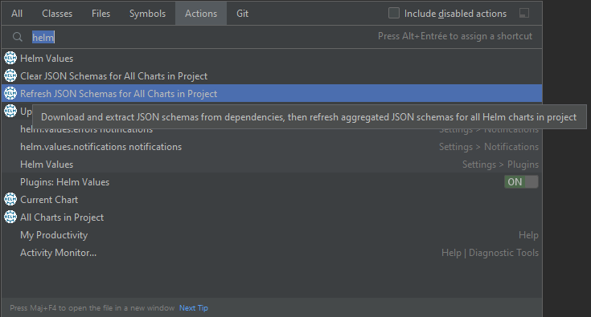
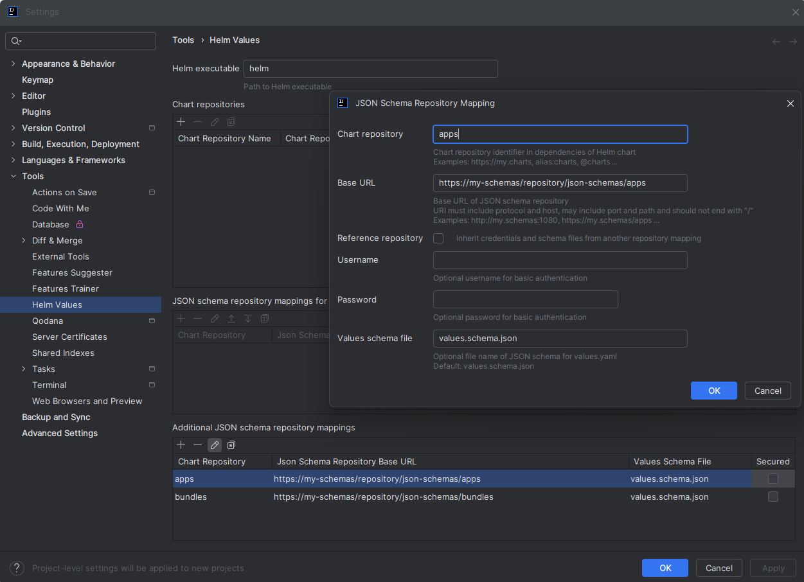
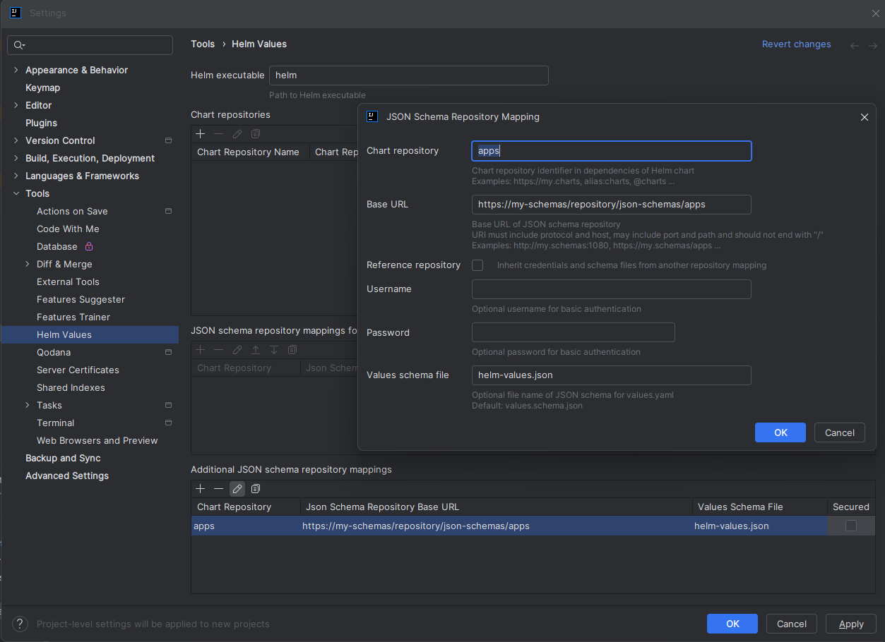
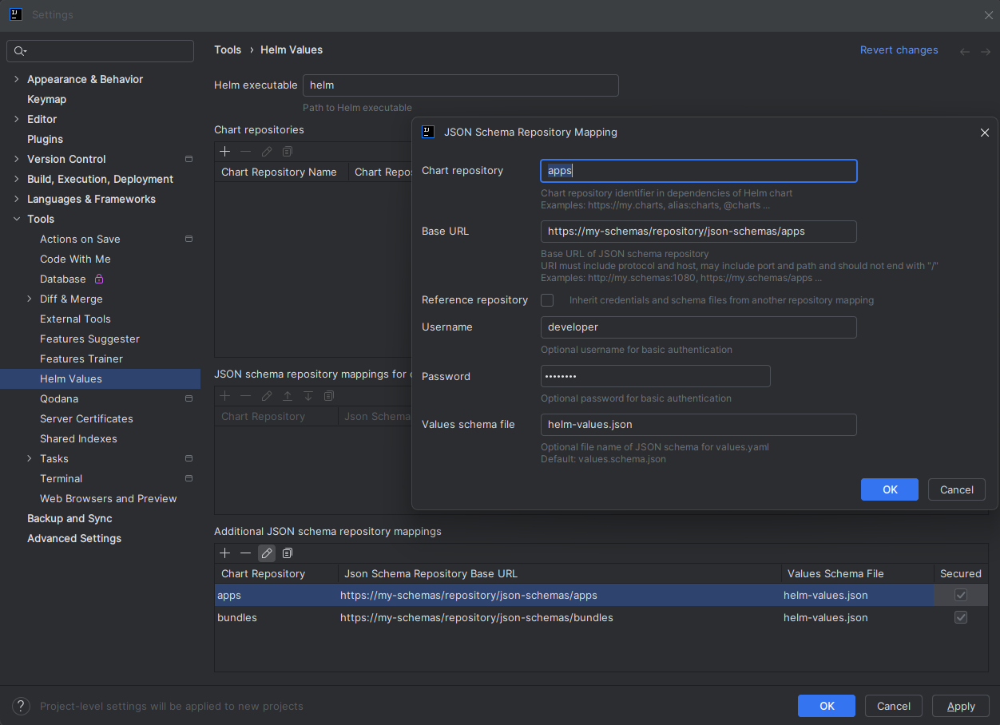
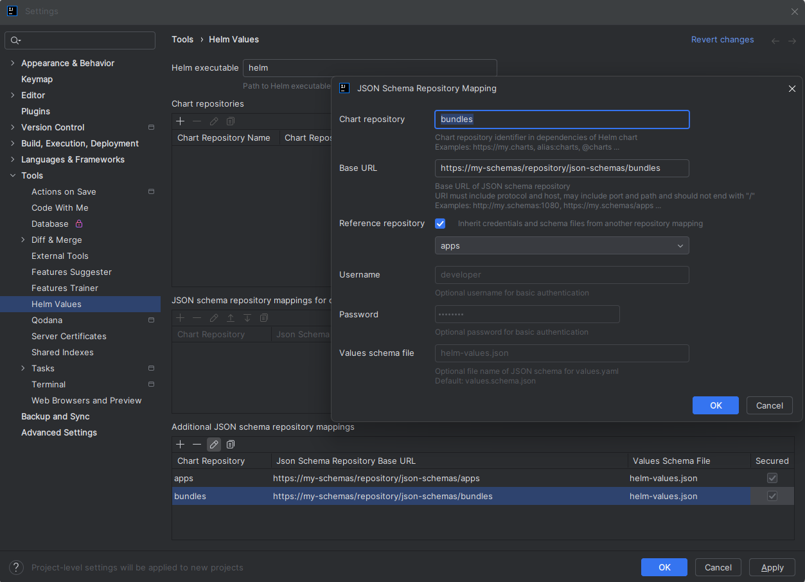

# IntelliJ plugin for Helm values


[](https://plugins.jetbrains.com/plugin/19970-helm-values-assistant)
[](https://plugins.jetbrains.com/plugin/19970-helm-values-assistant)

<!-- Plugin description -->
**Generate JSON schemas to help writing values for [Helm charts](https://helm.sh/).**

The plugin provides several actions to generate [JSON schemas](https://json-schema.org/) for a Helm chart.\
These schemas can then be used to document, validate and auto-complete Helm values in your IDE.

Since Helm v3, Helm charts can package a [JSON schema](https://helm.sh/docs/topics/charts/#schema-files)
named `values.schema.json` to validate values when Helm chart is installed.\
The plugin can extract packaged JSON schemas from chart dependencies.

It can also be configured to download JSON schemas of dependencies from external JSON schema repositories.

Plugin provides actions to aggregate extracted and downloaded JSON schemas into a single JSON schema
that can be used to provide validation, auto-completion and documentation on values.yaml in your IDE.

More information: [Helm values documentation](https://github.com/fstaudt/helm-values#readme)
<!-- Plugin description end -->

## Actions

### Refresh JON schemas for current chart

Action *Refresh JSON schema for current chart* is available from `Chart.yaml` or `values.yaml`.


Action will trigger the following processing:

- clear previously extracted JSON schemas
- download JSON schemas from external JSON schema repositories (unless already downloaded)\
  *Action only attempts to download JSON schemas for each dependency*
  *if a repository mapping is defined for the Helm repository of the dependency.*\
  *Check dedicated section to [configure JSON schema repositories](#configure-json-schema-repositories).*\
  *A fallback schema is generated if package of chart dependency is missing or invalid.*\
  *The description of the fallback schema provides more information on the extract issue.*
- extract file `values.schema.json` from chart dependencies (if available)\
  *Action only attempts to extract file `values.schema.json` from archive of each dependency*
  *if a repository mapping is **not** defined for the Helm repository of the dependency.*\
  *Check dedicated section to [configure JSON schema repositories](#configure-json-schema-repositories).*\
  *A fallback schema is generated if JSON schema can't be downloaded from the external repository*
  *(schema not found, network failure ...).*\
  *The description of the fallback schema provides more information on the download issue.*
- generate JSON schema `aggregated-values.schema.json` in `.idea/json-schemas`
- generate JSON schema `extra-values.schema.json` in `.idea/json-schemas`

The JSON schema `aggregated-values.schema.json` is used by default to validate file `values.yaml`
in the same folder as `Chart.yaml`.\
Additional JSON schema mappings can be configured in IntelliJ settings if required.

The JSON schema `extra-values.schema.json` is used by default to validate any file named `*-values.yaml`
in the same folder as `Chart.yaml`.\
Additional JSON schema mappings can be configured in IntelliJ settings if required.

Optional file `aggregated-values.schema.patch.json` can be created in the base folder of the chart
(same folder as Chart.yaml) to [patch aggregated JSON schema](https://jsonpatch.com/).\
Optional file `extra-values.schema.patch.json` can be created in the base folder of the chart
(same folder as Chart.yaml) to [patch extra values JSON schema](https://jsonpatch.com/).\
For more information on patch files, check dedicated section
on [patch for generated JSON schemas](../README.md#patch-for-generated-json-schemas).

### Clear JSON schemas for current chart

Action *Clear JSON schema for current chart* is available from `Chart.yaml` or `values.yaml`.


Action will trigger the following processing:

- clear previously extracted JSON schemas for the current chart
- clear previously downloaded JSON schemas for the current chart
- clear generated JSON schemas for the current chart (`aggregated-values.schema.json`, `extra-values.schema.json`)

### Refresh JSON schemas for all charts in project

Action *Refresh JSON schemas for all charts in project* is available from actions search.



It will trigger the refresh of JSON schemas for each chart in the project
(i.e. for each file named `Chart.yaml` in the project).

### Clear JSON schemas for all charts in project

Action *Clear JSON schema for all charts in project* is available from actions search.


It will clear JSON schemas for each chart in the project (i.e. for each file named `Chart.yaml` in the project).

## Configure JSON schema repositories

As explained in [introduction](../README.md#json-schema-repositories),
plugin can be configured to download JSON schemas from external JSON schema repositories.

### JSON schema repository mappings

Repository mappings can be configured in plugin settings to define JSON schema repository for each Helm repository.

Aggregation actions use the repository key in dependencies of `Chart.yaml` to define the JSON schema repository
that must be used to download JSON schemas for each dependency.

Given the following Chart.yaml:

```yaml
apiVersion: v2
name: my-bundle
version: 0.1.0
dependencies:
  - name: another-bundle
    version: 0.2.0
    repository: "@bundles"
  - name: simple-app
    version: 0.3.0
    repository: "@apps"
  - name: thirdparty-chart
    version: 0.4.0
    repository: "@thirdparty"
```

The plugin must be configured with following configuration to download JSON schemas for the first 2 dependencies:



### Custom JSON schema file names

Default file names for JSON schemas can be overridden for each repository in plugin settings.



**Deprecation notice**: *`globalValuesSchemaFile` is deprecated and will be removed in `1.0.0`.*

### JSON schema repository security

JSON schema repositories can be secured with basic authentication.

Each schema repository can be configured with user and password in plugin settings.



*:bulb: credentials are stored securely in IntelliJ password safe.*

### Reference repository mapping

A reference repository mapping can be defined for each repository in plugin settings.

When selected, credentials and schema file names are inherited from the reference repository mapping.\
Inherited configuration is displayed in read-only in editor.



## Screenshots

#### Get documentation in values.yaml


#### Get validation and auto-completion in values.yaml


