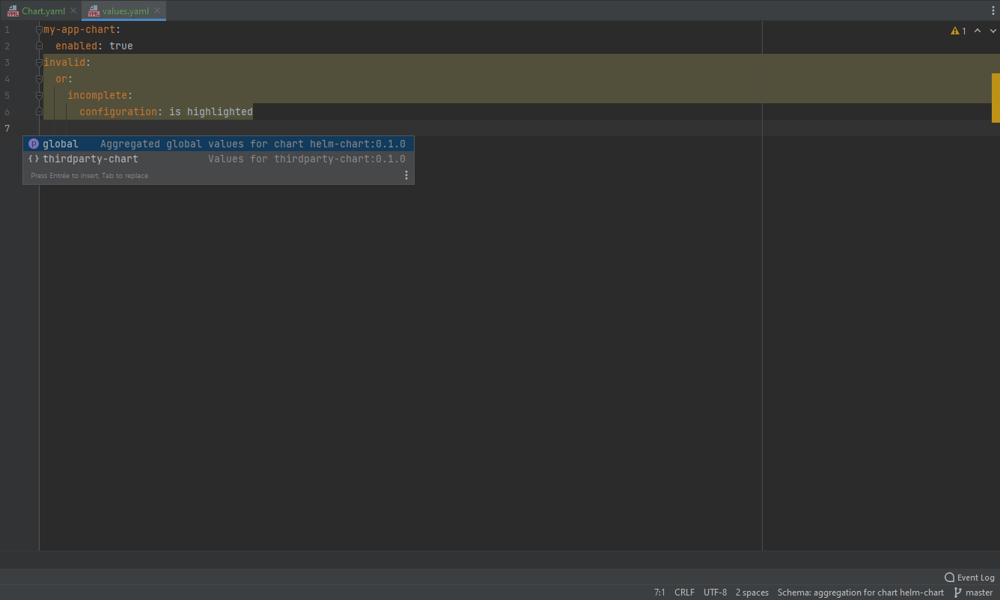

# Helm values assistant

<!-- Plugin description -->
Generate aggregated JSON schema to help define values for [Helm charts](https://helm.sh/).

The plugin provides several actions to generate aggregated [JSON schemas](https://json-schema.org/) for a Helm chart.\
These schemas can then be used to document, validate and auto-complete Helm values in your IDE.

It only supports Helm3 and requires all dependencies to be defined in `Chart.yaml`.\
File `dependencies.yaml` previously used in Helm2 to define dependencies is not supported.

Since Helm3, Helm charts can contain a [JSON schema](https://helm.sh/docs/topics/charts/#schema-files) to validate
values when Helm chart is installed.\
The plugin extracts those JSON schemas from chart dependencies and aggregate those in a single JSON schema.\
The aggregated JSON schema can then be used to provide auto-completion, validation and documentation on values.yaml in
your IDE.

The plugin can also be configured to download JSON schemas from external JSON schemas repositories.\
This can be useful to provide documentation for Helm charts that do not contain a JSON schema.\
A mapping can be configured for each Helm repository to define the location of the JSON schemas for this repository.\
Downloaded JSON schemas are also aggregated in the single JSON schema and have precedence on extracted schemas.

<!-- Plugin description end -->

## Screenshots

## Installation

- Using IDE built-in plugin system:

  <kbd>Settings/Preferences</kbd> > <kbd>Plugins</kbd> > <kbd>Marketplace</kbd> > <kbd>Search for "
  helm-values-assistant"</kbd> >
  <kbd>Install Plugin</kbd>

- Manually:

  Download the [latest release](https://github.com/fstaudt/helm-values-assistant/releases/latest) and install it
  manually using
  <kbd>Settings/Preferences</kbd> > <kbd>Plugins</kbd> > <kbd>⚙️</kbd> > <kbd>Install plugin from disk...</kbd>

---
Plugin based on the [IntelliJ Platform Plugin Template][template].

## Template ToDo list

- [x] Create a new [IntelliJ Platform Plugin Template][template] project.
- [x] Get familiar with the [template documentation][template].
- [x] Verify the [pluginGroup](/gradle.properties), [plugin ID](/src/main/resources/META-INF/plugin.xml)
  and [sources package](/src/main/kotlin).
- [x] Review the [Legal Agreements](https://plugins.jetbrains.com/docs/marketplace/legal-agreements.html).
- [x] [Publish a plugin manually](https://plugins.jetbrains.com/docs/intellij/publishing-plugin.html?from=IJPluginTemplate)
  for the first time.
- [x] Set the Plugin ID in the above README badges.
- [ ] Set the [Deployment Token](https://plugins.jetbrains.com/docs/marketplace/plugin-upload.html).

[template]: https://github.com/JetBrains/intellij-platform-plugin-template
